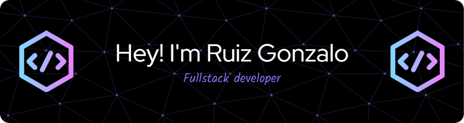

=============================

Systems Engineering student and fullstack developer from :argentina: Argentina.

* 🖥️  Visit my portfolio [here](http://rgonza14.github.io/)
* ✉️  Contact me at [r.gonza1425@gmail.com](mailto:r.gonza1425@gmail.com)
  
## Technologies

### Frontend

### Backend

### Databases

### ORM

### Others

